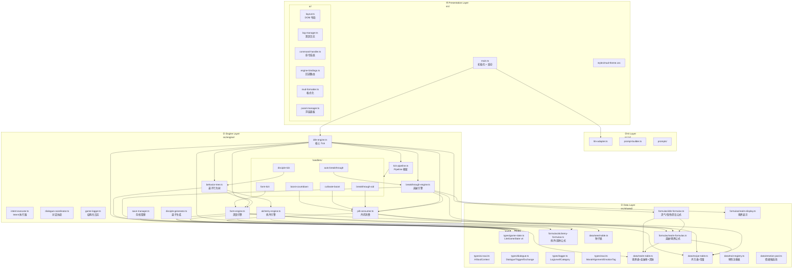

# 分层架构详情

> **来源**：MASTER-ARCHITECTURE 拆分 | **维护者**：/SGA
> **索引入口**：[MASTER-ARCHITECTURE.md](../MASTER-ARCHITECTURE.md) §1

---

## §1 四层架构 Mermaid 图

---

## §2 层级职责与文件清单

| 层级 | 职责 | 文件数 | 文件列表 |
|------|------|:------:|---------| 
| **① Data** | 类型定义 + 公式 + 数据表（所有层的只读依赖） | 20 | `game-state.ts`, `ai-soul.ts`, `dialogue.ts`, `logger.ts`, `soul.ts`, `relationship-memory.ts`, `causal-event.ts`, `personal-goal.ts`, `t2-npc.ts`, `idle-formulas.ts`, `realm-formulas.ts`, `alchemy-formulas.ts`, `realm-display.ts`, `realm-table.ts`, `recipe-table.ts`, `seed-table.ts`, `trait-registry.ts`, `emotion-pool.ts`, `emotion-behavior-modifiers.ts`, `goal-data.ts` |
| **② Engine** | 游戏引擎逻辑（tick / 行为树 / 存档 / 日志 / 对话 / 灵魂 / AI 缓冲 / 关系记忆 / 目标） | 28 | `idle-engine.ts`, `tick-pipeline.ts`, `event-bus.ts`, `soul-engine.ts`, `async-ai-buffer.ts`, `action-executor.ts`, `relationship-memory-manager.ts`, `goal-manager.ts`, `handlers/boost-countdown.handler.ts`, `handlers/breakthrough-aid.handler.ts`, `handlers/auto-breakthrough.handler.ts`, `handlers/farm-tick.handler.ts`, `handlers/soul-tick.handler.ts`, `handlers/disciple-tick.handler.ts`, `handlers/soul-event.handler.ts`, `handlers/ai-result-apply.handler.ts`, `handlers/dialogue-tick.handler.ts`, `handlers/cultivate-boost.handler.ts`, `handlers/goal-tick.handler.ts`, `behavior-tree.ts`, `intent-executor.ts`, `dialogue-coordinator.ts`, `game-logger.ts`, `farm-engine.ts`, `alchemy-engine.ts`, `breakthrough-engine.ts`, `pill-consumer.ts`, `save-manager.ts`, `disciple-generator.ts` |
| **③ AI** | AI 适配层（LLM 调用 / prompt 构建 / fallback / 灵魂评估 / AI 决策 / 叙事片段） | 9+ | `llm-adapter.ts`, `prompt-builder.ts`, `soul-prompt-builder.ts`, `soul-evaluator.ts`, `few-shot-examples.ts`, `action-pool-builder.ts`, `narrative-snippet-builder.ts`, `prompts/` 目录, `fallback-lines.ts`, `bystander-lines.ts` |
| **④ Presentation** | DOM 布局 / 命令系统 / 日志管理 / 浮层面板 / 引擎回调路由 / MUD 格式化 | 8 | `main.ts`（初始化+启动）, `ui/layout.ts`, `ui/log-manager.ts`, `ui/panel-manager.ts`, `ui/command-handler.ts`, `ui/engine-bindings.ts`, `ui/mud-formatter.ts`, `styles/mud-theme.css` |

---

## 变更日志

| 日期 | 变更内容 |
|------|---------|
| 2026-03-28 | 从 MASTER-ARCHITECTURE.md §1 拆出 |
| 2026-03-28 | Phase 4 重构: 新增 tick-pipeline.ts + handlers/ 目录（6 文件），Engine 层 8→15 文件 |
| 2026-03-28 | Phase D: Data +2 (dialogue.ts, logger.ts), Engine +4 (intent-executor, dialogue-coordinator, game-logger, dialogue-tick.handler), AI +1 (bystander-lines); Engine 15→19, Data 9→11, AI 3→4+ |
| 2026-03-28 | Phase D Hotfix: BehaviorIntent 新增 timerDelta 字段; SmartLLMAdapter 移除自动重试改为手动 tryConnect; FallbackLLMAdapter 对话改 2 轮; 弟子 4→8 人 + 新性格(孤傲/恐懦); reset 命令实装 |
| 2026-03-29 | Phase E: Data +3 (soul.ts, trait-registry.ts, emotion-pool.ts), Engine +3 (event-bus, soul-engine, soul-tick.handler, soul-event.handler), AI +1 (soul-prompt-builder); GameState v3→v4; Data 11→14, Engine 19→22, AI 4+→5+ |
| 2026-03-30 | Phase F: Data +1 (emotion-behavior-modifiers.ts), soul.ts +DiscipleEmotionState; Data 14→15; behavior-tree +getEnhancedPersonalityWeights; tick-pipeline TickContext +emotionMap; idle-engine +emotionMap |
| 2026-03-30 | Phase H-α: Data +1 (zone-descriptions.ts); Presentation 拆分出 ui/mud-formatter.ts; Presentation 1→2 文件; 零 Engine/Pipeline 变更 |
| 2026-03-30 | Phase G: Engine +3 (async-ai-buffer, ai-result-apply.handler, action-executor); AI +3 (soul-evaluator, few-shot-examples, action-pool-builder); Engine 22→25, AI 5+→8+ |
| 2026-03-31 | Phase X-α: main.ts 巨石拆分（606→114行）；Presentation +5 新文件（layout.ts, log-manager.ts, command-handler.ts, engine-bindings.ts, styles/mud-theme.css）；所有内联 style→CSS class；日志分区（主事件流+系统消息条）；Presentation 1→7 文件 |
| 2026-03-31 | Phase X-γ: +panel-manager.ts（浮层面板）；Presentation 7→8 文件；log-manager 内存修复（BUG-Xγ-01）|
| 2026-04-01 | Phase IJ v3.0: Data +4 (relationship-memory.ts, causal-event.ts, personal-goal.ts, t2-npc.ts); Engine +1 (relationship-memory-manager.ts); AI +1 (narrative-snippet-builder.ts); Data 15→19, Engine 25→26, AI 8+→9+ |
| 2026-04-01 | Phase J-Goal: Data +1 (goal-data.ts); Engine +2 (goal-manager.ts, handlers/goal-tick.handler.ts); Data 19→20, Engine 26→28 |
