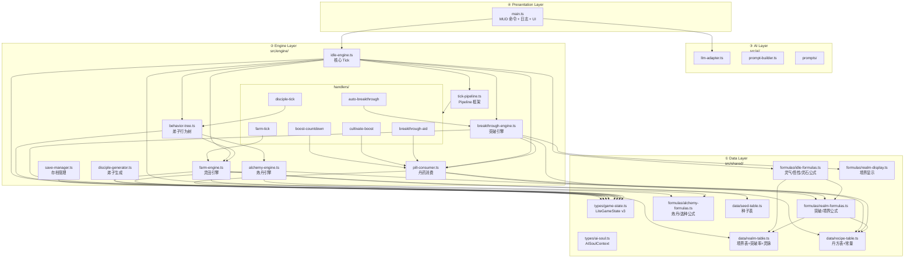

# 分层架构详情

> **来源**：MASTER-ARCHITECTURE 拆分 | **维护者**：/SGA
> **索引入口**：[MASTER-ARCHITECTURE.md](../MASTER-ARCHITECTURE.md) §1

---

## §1 四层架构 Mermaid 图

---

## §2 层级职责与文件清单

| 层级 | 职责 | 文件数 | 文件列表 |
|------|------|:------:|---------| 
| **① Data** | 类型定义 + 公式 + 数据表（所有层的只读依赖） | 9 | `game-state.ts`, `ai-soul.ts`, `idle-formulas.ts`, `realm-formulas.ts`, `alchemy-formulas.ts`, `realm-display.ts`, `realm-table.ts`, `recipe-table.ts`, `seed-table.ts` |
| **② Engine** | 游戏引擎逻辑（tick / 行为树 / 存档） | 15 | `idle-engine.ts`, `tick-pipeline.ts`, `handlers/boost-countdown.handler.ts`, `handlers/breakthrough-aid.handler.ts`, `handlers/auto-breakthrough.handler.ts`, `handlers/farm-tick.handler.ts`, `handlers/disciple-tick.handler.ts`, `handlers/cultivate-boost.handler.ts`, `behavior-tree.ts`, `farm-engine.ts`, `alchemy-engine.ts`, `breakthrough-engine.ts`, `pill-consumer.ts`, `save-manager.ts`, `disciple-generator.ts` |
| **③ AI** | AI 适配层（LLM 调用 / prompt 构建） | 3+ | `llm-adapter.ts`, `prompt-builder.ts`, `prompts/` 目录 |
| **④ Presentation** | DOM 组件 / 命令系统 / MUD 面板 | 1 | `main.ts`（含 UI 初始化、命令系统、引擎回调、AI 集成） |

---

## 变更日志

| 日期 | 变更内容 |
|------|---------|
| 2026-03-28 | 从 MASTER-ARCHITECTURE.md §1 拆出 |
| 2026-03-28 | Phase 4 重构: 新增 tick-pipeline.ts + handlers/ 目录（6 文件），Engine 层 8→15 文件 |
