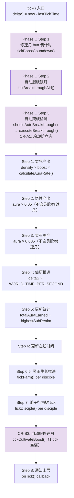
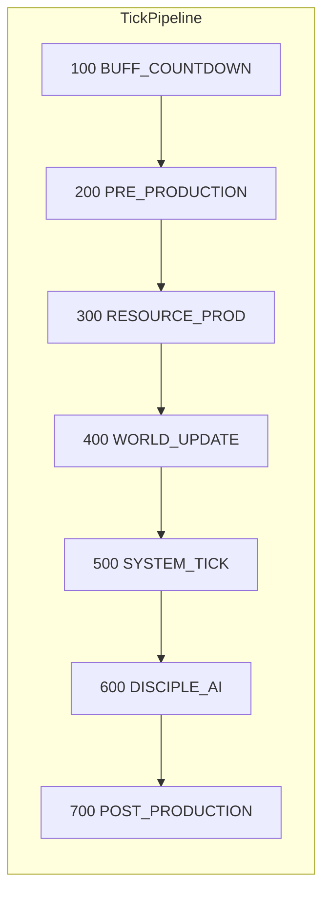

# 引擎 Tick Pipeline

> **来源**：MASTER-ARCHITECTURE 拆分 | **维护者**：/SGA
> **索引入口**：[MASTER-ARCHITECTURE.md](../MASTER-ARCHITECTURE.md) §3
> **硬约束**：修改此文件必须同步运行 `npm run test:regression`

---

## §1 当前实现（硬编码结构）

> 来源：`idle-engine.ts` L128-L223



**执行顺序表**（12 步）：

| # | 阶段 | 代码位置 | 职责 | 系统 |
|---|------|---------|------|------|
| 1 | BUFF_COUNTDOWN | L136-138 | 修速丹 buff 倒计时 | pill-consumer |
| 2 | PRE_PRODUCTION | L140-142 | 自动服破镜丹 | pill-consumer |
| 3 | PRE_PRODUCTION | L144-156 | 自动突破检测+执行 | breakthrough-engine |
| 4 | RESOURCE_PROD | L158-166 | 灵气产出 | idle-engine (核心) |
| 5 | RESOURCE_PROD | L168-172 | 悟性产出 | idle-engine (核心) |
| 6 | RESOURCE_PROD | L174-178 | 灵石副产 | idle-engine (核心) |
| 7 | WORLD_UPDATE | L180-181 | 仙历推进 | idle-engine (核心) |
| 8 | WORLD_UPDATE | L183-190 | 统计+在线时间 | idle-engine (核心) |
| 9 | SYSTEM_TICK | L192-200 | 灵田生长推进 | farm-engine |
| 10 | DISCIPLE_AI | L202-210 | 弟子行为树 tick | behavior-tree |
| 11 | POST_PRODUCTION | L212-214 | 自动服修速丹 | pill-consumer |
| 12 | NOTIFY | L221-222 | 通知上层 | idle-engine (核心) |

---

## §2 目标架构（TickPhase 枚举 + Handler 接口）



```typescript
export enum TickPhase {
  BUFF_COUNTDOWN   = 100,
  PRE_PRODUCTION   = 200,
  RESOURCE_PROD    = 300,
  WORLD_UPDATE     = 400,
  SYSTEM_TICK      = 500,
  DISCIPLE_AI      = 600,
  POST_PRODUCTION  = 700,
}

export interface TickHandler {
  name: string;
  phase: TickPhase;
  execute(state: LiteGameState, deltaS: number, logs: string[]): void;
}
```

---

## §3 当前→目标对照

| 当前 (硬编码) | 目标 (Handler) | handler 文件 |
|-------------|---------------|-------------|
| L136-138 tickBoostCountdown | BUFF_COUNTDOWN (100) | `handlers/boost-countdown.ts` |
| L140-142 tickBreakthroughAid | PRE_PRODUCTION (200) | `handlers/breakthrough-aid.ts` |
| L144-156 shouldAutoBreakthrough | PRE_PRODUCTION (200) | `handlers/auto-breakthrough.ts` |
| L158-190 灵气/悟性/灵石/时间/统计 | RESOURCE_PROD (300) + WORLD_UPDATE (400) | **保留在核心引擎** |
| L192-200 tickFarm | SYSTEM_TICK (500) | `handlers/farm-tick.ts` |
| L202-210 tickDisciple | DISCIPLE_AI (600) | `handlers/disciple-tick.ts` |
| L212-214 tickCultivateBoost | POST_PRODUCTION (700) | `handlers/cultivate-boost.ts` |

**Handler 拆分判定标准**：
- **保留在核心**：tick 间无条件执行、无系统前置条件、是基础资源产出逻辑
- **提取为 handler**：有开关条件（if 判断）、有系统依赖、是 Phase B+ 新增的

---

## 变更日志

| 日期 | 变更内容 |
|------|---------|
| 2026-03-28 | 从 MASTER-ARCHITECTURE.md §3 拆出 |
