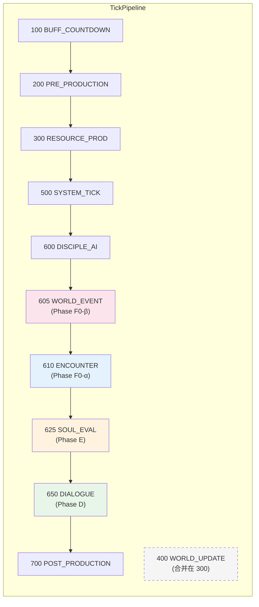

# 引擎 Tick Pipeline

> **来源**：MASTER-ARCHITECTURE 拆分 | **维护者**：/SGA
> **索引入口**：[MASTER-ARCHITECTURE.md](../MASTER-ARCHITECTURE.md) §3
> **硬约束**：修改此文件必须同步运行 `npm run test:regression`

---

## §1 Pipeline 架构（Phase 4 重构后）

> TickPipeline + TickHandler 模式。每个 Handler 按 `phase + order` 排序执行。
> 基础设施：`src/engine/tick-pipeline.ts`（TickPhase, TickHandler, TickContext, TickPipeline）



### TickPhase 定义

```typescript
export const TickPhase = {
  BUFF_COUNTDOWN:   100,
  PRE_PRODUCTION:   200,
  RESOURCE_PROD:    300,
  WORLD_UPDATE:     400,  // 当前合并在 core-production handler
  SYSTEM_TICK:      500,
  DISCIPLE_AI:      600,
  WORLD_EVENT:      605,  // Phase F0-β: 世界事件抽取
  ENCOUNTER:        610,  // Phase F0-α: 碰面检定 (ADR-F0α-01)
  SOUL_EVAL:        625,  // Phase E: 灵魂事件评估
  DIALOGUE:         650,  // Phase D: 弟子间对话触发
  POST_PRODUCTION:  700,
} as const;
```

---

## §2 Handler 清单

| # | Handler 名称 | Phase | Order | 文件 | 系统 | 来源 |
|---|-------------|:-----:|:-----:|------|------|------|
| 1 | `boost-countdown` | 100 | 0 | `handlers/boost-countdown.handler.ts` | pill-consumer | Phase C |
| 2 | `breakthrough-aid` | 200 | 0 | `handlers/breakthrough-aid.handler.ts` | pill-consumer | Phase C |
| 3 | `auto-breakthrough` | 200 | 10 | `handlers/auto-breakthrough.handler.ts` | breakthrough-engine | Phase C |
| 4 | `core-production` | 300 | 0 | `idle-engine.ts`（内联） | idle-engine 核心 | Phase A |
| 5 | `farm-tick` | 500 | 0 | `handlers/farm-tick.handler.ts` | farm-engine | Phase B-α |
| 6 | `soul-tick` | 500 | 10 | `handlers/soul-tick.handler.ts` | soul-engine | Phase E |
| 7 | `disciple-tick` | 600 | 0 | `handlers/disciple-tick.handler.ts` | behavior-tree (Intent 模式) | Phase A → Phase D 重构 |
| 8 | `soul-event` | 625 | 0 | `handlers/soul-event.handler.ts` | soul-engine + EventBus | Phase E |
| 9 | `dialogue-tick` | 650 | 0 | `handlers/dialogue-tick.handler.ts` | dialogue-coordinator | Phase D |
| 10 | `cultivate-boost` | 700 | 0 | `handlers/cultivate-boost.handler.ts` | pill-consumer | Phase C |
| 11 | `encounter-tick` | 610 | 0 | `handlers/encounter-tick.handler.ts` | encounter-engine | Phase F0-α |
| 12 | `world-event-tick` | 605 | 0 | `handlers/world-event-tick.handler.ts` | storyteller | Phase F0-β |
| 13 | `ai-result-apply` | 625 | 5 | `handlers/ai-result-apply.handler.ts` | async-ai-buffer + soul-engine | Phase G |

### Handler 拆分判定标准

- **独立 handler 文件**：有开关条件（if 判断）、有系统依赖、是 Phase B+ 新增的
- **内联 handler**：tick 间无条件执行、是基础资源产出逻辑（TD-002 暂保留）

---

## §3 新系统接入协议

新增系统只需 3 步接入 Tick Pipeline：

```typescript
// 1. 创建 handler 文件: src/engine/handlers/my-system.handler.ts
import type { TickHandler, TickContext } from '../tick-pipeline';
import { TickPhase } from '../tick-pipeline';

export const mySystemHandler: TickHandler = {
  name: 'my-system',
  phase: TickPhase.SYSTEM_TICK,  // 选择合适的阶段
  order: 10,                     // 同阶段内排序
  execute(ctx: TickContext): void {
    // 业务逻辑
  },
};

// 2. 在 idle-engine.ts 构造函数中注册:
//    this.pipeline.register(mySystemHandler);

// 3. 更新本文件（arch/pipeline.md）Handler 清单
```

---

## §4 TickContext 说明

```typescript
export interface TickContext {
  state: LiteGameState;                    // 游戏状态引用
  deltaS: number;                          // tick 时间增量（秒）
  systemLogs: string[];                    // 系统日志收集器
  farmLogs: string[];                      // 灵田日志收集器
  discipleEvents: DiscipleBehaviorEvent[]; // 弟子行为事件
  onBreakthrough: BreakthroughCallback | null; // 突破回调
  breakthroughCooldown: number;            // 突破冷却计数器 (TD-001)
  emotionMap: Map<string, DiscipleEmotionState>; // Phase F: 短期情绪状态
  eventBus: EventBus;                      // Phase E: 灵魂事件总线 (ADR-E03)
  logger: GameLogger;                      // Phase D: 结构化日志
  asyncAIBuffer?: AsyncAIBuffer;           // Phase G: 异步 AI 缓冲区
  pendingStormEvent?: WorldEventPayload;   // Phase H-γ: STORM 事件信号（world-event-tick 设置）
}
```

> ⚠️ **TD-001**: `breakthroughCooldown` 通过 TickContext 暴露是已知技术债务。
> **ADR-E03**: `eventBus` 每 tick 新建，生命周期与 tick 绑定。
> **ADR-Hγ-01**: `pendingStormEvent` 由 world-event-tick 写入，IdleEngine 消费后创建裁决窗口。
> 详见 `docs/project/tech-debt.md`。

---

## 变更日志

| 日期 | 变更内容 |
|------|---------|
| 2026-03-28 | 从 MASTER-ARCHITECTURE.md §3 拆出 |
| 2026-03-28 | Phase 4 重构: 硬编码 → TickPipeline + 7 Handler，移除"当前硬编码"章节 |
| 2026-03-28 | Phase D: +DIALOGUE=650 阶段 +dialogue-tick handler; disciple-tick 重构为 Intent 模式; TickContext +dialogueTriggers +logger |
| 2026-03-29 | Phase E: +SOUL_EVAL=625 阶段; +soul-tick(500:10) +soul-event(625:0) Handler; TickContext +eventBus; auto-breakthrough 接入 EventBus; Handler 8→10 |
| 2026-03-30 | Phase F0-α: +ENCOUNTER=610 阶段; +encounter-tick(610:0) Handler; Handler 10→11 |
| 2026-03-30 | Phase F0-β: +WORLD_EVENT=605 阶段; +world-event-tick(605:0) Handler; Handler 11→12 |
| 2026-03-30 | Phase G: +ai-result-apply(625:5) Handler; TickContext +asyncAIBuffer; Handler 12→13 |
| 2026-03-31 | Phase H-γ: TickContext +pendingStormEvent; 裁决系统文档对齐 |
