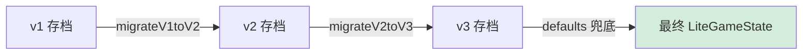

# 存档 Schema Registry

> **来源**：MASTER-ARCHITECTURE 拆分 | **维护者**：/SGA, /SGE
> **索引入口**：[MASTER-ARCHITECTURE.md](../MASTER-ARCHITECTURE.md) §5

---

## §1 版本变更链

| 版本 | Phase | 新增字段 | 删除字段 | 迁移函数 |
|:----:|:-----:|---------|---------|---------| 
| **v1** | A | — (初始) | — | — |
| **v2** | B-α | `disciples[].farmPlots`, `disciples[].currentRecipeId`, `pills[]`, `sect.tributePills` | `fields`, `alchemy` | `migrateV1toV2()` |
| **v3** | C | `breakthroughBuff`, `cultivateBoostBuff`, `lifetimeStats.pillsConsumed`, `lifetimeStats.breakthroughFailed` | — | `migrateV2toV3()` |

---

## §2 迁移策略



1. **链式迁移**：`if (version < 2) → migrateV1toV2()`，`if (version < 3) → migrateV2toV3()`
2. **defaults 兜底**：迁移后用 `createDefaultLiteGameState()` 的属性做浅合并，补全任何缺失字段
3. **版本号强制更新**：最终 `result.version = SAVE_VERSION (3)`

---

## §3 v1 完整字段列表

```
version, aura, spiritStones, realm, subRealm, daoFoundation,
comprehension, sect{name,level,reputation,auraDensity,stoneDripAccumulator},
disciples[]{id,name,starRating,realm,subRealm,aura,personality,personalityName,
  spiritualRoots,behavior,lastDecisionTime,behaviorTimer,stamina},
relationships[], bountyBoard, aiContexts, materialPouch,
inGameWorldTime, lastOnlineTime, lifetimeStats{alchemyTotal,alchemyPerfect,
  highestRealm,highestSubRealm,totalAuraEarned,breakthroughTotal},
fields[], alchemy{}
```

---

## §4 v2 变更

- ➕ `disciples[].farmPlots: FarmPlot[]`
- ➕ `disciples[].currentRecipeId: string | null`
- ➕ `pills: PillItem[]`
- ➕ `sect.tributePills: number`
- ➖ `fields: FieldSlot[]`
- ➖ `alchemy: AlchemyState`

---

## §5 v3 变更

- ➕ `breakthroughBuff: BreakthroughBuffState`
- ➕ `cultivateBoostBuff: CultivateBoostBuff | null`
- ➕ `lifetimeStats.pillsConsumed: number`
- ➕ `lifetimeStats.breakthroughFailed: number`

---

## 变更日志

| 日期 | 变更内容 |
|------|---------|
| 2026-03-28 | 从 MASTER-ARCHITECTURE.md §5 拆出 |
