# 存档 Schema Registry

> **来源**：MASTER-ARCHITECTURE 拆分 | **维护者**：/SGA, /SGE
> **索引入口**：[MASTER-ARCHITECTURE.md](../MASTER-ARCHITECTURE.md) §5
> **同级互引**：字段定义见 [gamestate.md](gamestate.md)

---

## §1 版本变更链

| 版本 | Phase | 新增字段 | 删除字段 | 迁移函数 |
|:----:|:-----:|---------|---------|---------| 
| **v1** | A | — (初始) | — | — |
| **v2** | B-α | `disciples[].farmPlots`, `disciples[].currentRecipeId`, `pills[]`, `sect.tributePills` | `fields`, `alchemy` | `migrateV1toV2()` |
| **v3** | C | `breakthroughBuff`, `cultivateBoostBuff`, `lifetimeStats.pillsConsumed`, `lifetimeStats.breakthroughFailed` | — | `migrateV2toV3()` |
| **v4** | E | `disciples[].moral`, `disciples[].initialMoral`, `disciples[].traits`, `RelationshipEdge.affinity`, `RelationshipEdge.tags`, `RelationshipEdge.lastInteraction` | `RelationshipEdge.value` | `migrateV3toV4()` |
| **v5** | F0-α | `sect.ethos`, `sect.discipline` | — | `migrateV4toV5()` |
| **v6** | J-Goal | `goals: PersonalGoal[]` | — | `migrateV5toV6()` |
| **v7** | GS | `disciples[].gender: Gender` | — | `migrateV6toV7()` |
| **v8** | I-beta | `RelationshipEdge.closeness/attraction/trust/status`, `disciples[].orientation` | `RelationshipEdge.affinity` | `migrateV7toV8()` |

---

## §2 迁移策略

```mermaid
graph LR
    V1["v1 存档"] -->|migrateV1toV2| V2["v2 存档"]
    V2 -->|migrateV2toV3| V3["v3 存档"]
    V3 -->|migrateV3toV4| V4["v4 存档"]
    V4 -->|migrateV4toV5| V5["v5 存档"]
    V5 -->|migrateV5toV6| V6["v6 存档"]
    V6 -->|migrateV6toV7| V7["v7 存档"]
    V7 -->|migrateV7toV8| V8["v8 存档"]
    V8 -->|defaults 兜底| FINAL["最终 LiteGameState"]
    style FINAL fill:#d4edda
    style V8 fill:#fff3e0
```



1. **链式迁移**：`if (version < 2) → migrateV1toV2()`，...，`if (version < 7) → migrateV6toV7()`，`if (version < 8) → migrateV7toV8()`
2. **defaults 兜底**：迁移后用 `createDefaultLiteGameState()` 的属性做浅合并，补全任何缺失字段
3. **版本号强制更新**：最终 `result.version = SAVE_VERSION (8)`

---

## §3 v1 完整字段列表

```
version, aura, spiritStones, realm, subRealm, daoFoundation,
comprehension, sect{name,level,reputation,auraDensity,stoneDripAccumulator},
disciples[]{id,name,starRating,realm,subRealm,aura,personality,personalityName,
  spiritualRoots,behavior,lastDecisionTime,behaviorTimer,stamina},
relationships[], bountyBoard, aiContexts, materialPouch,
inGameWorldTime, lastOnlineTime, lifetimeStats{alchemyTotal,alchemyPerfect,
  highestRealm,highestSubRealm,totalAuraEarned,breakthroughTotal},
fields[], alchemy{}
```

---

## §4 v2 变更

- ➕ `disciples[].farmPlots: FarmPlot[]`
- ➕ `disciples[].currentRecipeId: string | null`
- ➕ `pills: PillItem[]`
- ➕ `sect.tributePills: number`
- ➖ `fields: FieldSlot[]`
- ➖ `alchemy: AlchemyState`

---

## §5 v3 变更

- ➕ `breakthroughBuff: BreakthroughBuffState`
- ➕ `cultivateBoostBuff: CultivateBoostBuff | null`
- ➕ `lifetimeStats.pillsConsumed: number`
- ➕ `lifetimeStats.breakthroughFailed: number`

---

## §6 v4 变更 (Phase E)

- ➕ `disciples[].moral: MoralAlignment` — 道德双轴 {goodEvil, lawChaos} [-100, +100]
- ➕ `disciples[].initialMoral: MoralAlignment` — 初始道德（不可变，用于舸同漂移）
- ➕ `disciples[].traits: DiscipleTrait[]` — 先天/后天特性列表
- ➖ `RelationshipEdge.value: number` → `RelationshipEdge.affinity: number` — 重命名 + 语义扩展
- ➕ `RelationshipEdge.tags: RelationshipTag[]` — 关系标签（friend/rival/mentor等）
- ➕ `RelationshipEdge.lastInteraction: number` — 最后交互时间戳

---

## §7 v5→v6 变更 (Phase J-Goal)

- ➕ `goals: PersonalGoal[]` — 全局个人目标池（每个目标含 discipleId 归属）

迁移函数 `migrateV5toV6()`：新增 `goals: []` 空数组。零风险。

---

## §8 v6→v7 变更 (Phase GS)

- ➕ `disciples[].gender: Gender` — 弟子性别（`'male' | 'female' | 'unknown'`）

迁移函数 `migrateV6toV7()`：
1. 遍历 `disciples[]`，检查 `gender` 字段是否存在
2. 通过 `NAME_GENDER_MAP`（10 个已知名字→性别映射）推断性别
3. 未匹配名字 → `Math.random() < 0.5 ? 'female' : 'male'` 随机分配
4. `version = 7`

---

## §9 v7→v8 变更 (Phase I-beta)

- ➖ `RelationshipEdge.affinity: number` → `RelationshipEdge.closeness: number` — 重命名
- ➕ `RelationshipEdge.attraction: number` — 吸引力，初始 0
- ➕ `RelationshipEdge.trust: number` — 信任度，初始 affinity×0.5
- ➕ `RelationshipEdge.status: RelationshipStatus | null` — 关系状态，初始 null
- ➕ `disciples[].orientation: Orientation` — 性取向

迁移函数 `migrateV7toV8()`：
1. 遍历 `relationships[]`：`affinity` → `closeness`，`attraction = 0`，`trust = affinity × 0.5`，`status = null`
2. 遍历 `disciples[]`：`orientation = generateOrientation()`
3. `version = 8`

---

## 变更日志

| 日期 | 变更内容 |
|------|---------|
| 2026-03-28 | 从 MASTER-ARCHITECTURE.md §5 拆出 |
| 2026-03-29 | Phase E: +v4 变更链（moral/traits/affinity/tags/lastInteraction）+ migrateV3toV4 |
| 2026-03-30 | Phase F0-α: +v5 变更链（sect.ethos/sect.discipline）+ migrateV4toV5 |
| 2026-04-01 | Phase J-Goal: +v6 变更链（goals: PersonalGoal[]）+ migrateV5toV6 |
| 2026-04-02 | Phase GS: +v7 变更链（disciples[].gender: Gender）+ migrateV6toV7 |
| 2026-04-02 | Phase I-beta: +v8 变更链（RelationshipEdge closeness/attraction/trust/status + disciples[].orientation）+ migrateV7toV8 |
