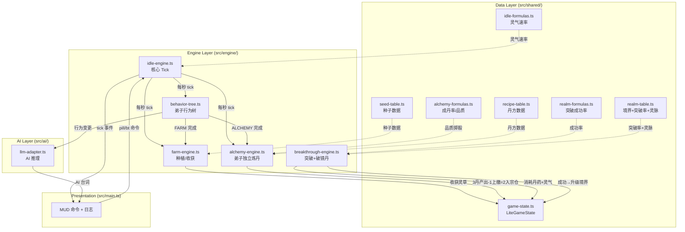

# 7game-lite Phase B 需求分析进度

> 创建日期：2026-03-28
> 状态：**分析完成，编码进行中**
> 项目定位：Phase B「骨架填充」— 在 Phase A 核心循环基础上补全灵田、炼丹、突破机制、灵脉+AI 深化三大子系统

---

## ⚠️ 文档层级说明

> [!IMPORTANT]
> 本文档下方 Step 1~10 的 ✅ 表示 **SGPA 分析/规划流程完成**，**不代表编码实现完成**。
> 编码实现进度请看下方「Implementation Status」段落。

## Implementation Status — 编码实现进度

> **范围**: Phase B-α（灵田+炼丹核心）。Phase C/D/E 另建文档。
> **编码开始**: 2026-03-28
> **上次更新**: 2026-03-28

| Story | 标题 | 编码状态 | 验证状态 | 备注 |
|-------|------|----------|----------|------|
| #1 | GameState 重构 + 存档迁移 v1→v2 | ✅ 完成 | ✅ `tsc` + 迁移测试 | |
| #2 | 灵田种植与收获 | ✅ 完成 | ✅ 选种测试 | |
| #3 | 弟子独立炼丹 | ✅ 完成 | ✅ Monte Carlo + 选丹方 | |
| #4 | 引擎 Tick 扩展 + MUD 日志 | ✅ 完成 | ⬜ 待浏览器验证 | |

### 编码阶段架构偏离记录

以下项目在编码执行时**偏离了本分析文档的原始设计**（经框架师审计后改进）：

| 偏离项 | 原始设计（本文档） | 实际实现 | 原因 |
|--------|-------------------|----------|------|
| Fix 6 `DiscipleAlchemyState` | 3 字段: `active`/`recipeId`/`remainingTicks` | 简化为 `currentRecipeId: string \| null` | `active` 与行为树 `behavior === ALCHEMY` 重复；`remainingTicks` 与 `behaviorTimer` 双重倒计时冲突 |
| Fix 1 时间戳模式 | `plantedAtTick`（引擎累计 tick） | `elapsedTicks`（累加模式） | 累加模式天然支持 FARM ×2 加速，无需维护全局 tickCount |
| FARM 行为模式 | 开始种、结束收 | 每 tick 连续劳作（成熟→收→补种） | 弟子 FARM 行为 20-35s 内应持续劳作 |

### 待后续 Phase 实现

| Phase | 内容 | 前置 |
|-------|------|------|
| Phase C | 突破+灵脉+丹药使用（破镜丹/修速丹/回灵丹效果） | B-α |
| Phase D | AI 深化+灵脉叙事 | B-α |
| Phase E | 丹毒系统 | C |

## Phase 0: 脚手架检查 — [✅]

| 目录 | 状态 |
|------|------|
| `docs/features/` | ✅ 已存在 |
| `docs/design/specs/` | ✅ 已存在 |
| `docs/verification/` | ✅ 已存在（含 Phase A 验证） |
| `scripts/` | ✅ 已存在 |
| `docs/INDEX.md` | ✅ 已存在 |

**代码基座检查：**
- `FieldSlot`, `AlchemyState`, `BountyBoard`, `BountyTask` 类型已在 `game-state.ts` 中定义
- `behavior-tree.ts` 已包含 ALCHEMY/FARM/BOUNTY 行为，但无实际系统逻辑
- `realm-formulas.ts` 已标记 `requiresTribulation: true`，天劫逻辑待实现
- `idle-engine.ts` tick 循环已就绪，可扩展新系统 tick

---

## Phase I: 需求分析

### Step 1: 价值锚定与体验闭环 — [✅]

Phase B 包含 4 个子系统（B1~B4），逐一锚定：

---

#### B1: 灵田系统

| 维度 | 内容 |
|------|------|
| **核心体验** | 弟子自主种田，以时间为代价换取灵草 — 体验「田园放置」的节奏感 |
| **ROI** | 低成本。仅需：种子数据表 + 生长 tick 逻辑 + 收获判定 |
| **循环挂载** | 消耗 → [弟子时间槽（FARM 行为占用）+ 灵石（买种子）] ；产出 → [灵草材料（炼丹输入）] |

#### B2: 炼丹系统

| 维度 | 内容 |
|------|------|
| **核心体验** | 用灵草炼制丹药，3 种丹药各有战略用途 — 体验「资源转化」的策略博弈 |
| **ROI** | 中成本。需新增：丹方表 + 品质判定公式 + 炼丹 tick + 丹药效果 |
| **循环挂载** | 消耗 → [灵草 + 灵石（高级丹方）] ；产出 → [回灵丹/修速丹/渡劫丹] |

#### B3: AI 深化 + 灵脉叙事

| 维度 | 内容 |
|------|------|
| **核心体验** | 弟子对种田/炼丹/突破发表 AI 台词 + 灵脉解封叙事 — 体验「有生命感的门派」 |
| **ROI** | 低成本。`llm-adapter.ts` 已就绪，仅需新增事件 prompt |
| **循环挂载** | 消耗 → [AI 推理（事件触发）] ；产出 → [沉浸式 MUD 文字流] |

**Phase B 资源循环拓扑：**

```
灵石 ──买种子──→ 弟子种田(时间) ──灵草──→ 炼丹 ──┬─回灵丹──→ 灵气补充
  ↑                                           ├─修速丹──→ 临时修炼加速
  │                                           └─破镜丹──→ 突破成功率↑
  └────────── 灵气副产 ←── 灵脉产出(auraDensity × realm) ←── 升级境界
```

**USER 决策记录：**
- Q1: ✅ 灵田**无限格**，不做图形化。弟子 FARM 行为占用时间为瓶颈，种/收时间控制投产比
- Q2: ✅ 3 丹方：回灵丹（即时回灵气）+ 修速丹（短时间修炼加速）+ 破镜丹（突破成功率↑，可叠加×3）
- Q3: ✅ 灵脉 = 宗主的囚牢。宗主越强 → 灵脉束缚越松 → auraDensity 越高 → 全局灵气产出越大
- Q4: ✅ **天劫系统本版本不做**。天劫是元婴→化神阶段内容，本版本止步筑基（不突破圆满）
- Q5: ✅ 渡劫丹 → **破镜丹**。每个小境界突破可吃，叠加上限 3 颗，后续引入丹毒系统做进一步限制
- Q6: ✅ 修速丹**不可叠加**，新的覆盖旧的

---

### Step 1.5: 技术可行性 PoC — [跳过]

> 已有技术栈，跳过。Phase B 全部系统使用现有 TypeScript + tick engine + llm-adapter，无新技术依赖。

---

### Step 2: 实体与数据基石 — [✅]

**前置动作**：已 `grep_search` 确认 `FieldSlot`/`AlchemyState` 仅在 `game-state.ts` 中定义，无引擎引用，可安全重构。
**参考来源**：已读取 7waygame `alchemy-formulas.ts`、`recipe-table.ts`、`01-core-systems.md` §四。

#### 2.1 实体变更清单

| 操作 | 实体 | 说明 |
|------|------|------|
| **重构** | `FieldSlot` → `FarmPlot` | 从固定格子改为弟子级动态种植记录 |
| **重构** | `AlchemyState` | 增加品质 + 成功率相关字段 |
| **新增** | `SeedDef` | 种子定义（数据表） |
| **新增** | `RecipeDef` / `PillItem` | 丹方定义 + 背包丹药实例（参考 7waygame `RecipeData`） |
| **新增** | `BreakthroughBuffState` | 破镜丹 buff 状态（已服用数量+品质列表） |
| **修改** | `LiteDiscipleState` | 新增 `farmPlots: FarmPlot[]` |
| **修改** | `SectState` | `auraDensity` 改为 realm 联动（灵脉叙事） |
| **修改** | `LiteGameState` | 移除 `fields: FieldSlot[]`，新增 `pills: PillItem[]`，新增 `breakthroughBuff` |
| **删除** | ~~`TribulationResult`~~ | 天劫本版本不做，删除 |

#### 2.2 TypeScript Interface 草案

```typescript
// ===== 种子定义（数据表） =====
export interface SeedDef {
  id: string;              // 'low-herb' | 'mid-herb' | 'break-herb'
  name: string;
  growthTimeSec: number;   // 生长总时间（秒）
  harvestYield: number;    // 收获产量（份）
  costStones: number;      // 购买种子费用（灵石）
  requiredRealm: number;   // 解锁所需大境界
}

// ===== 弟子种植记录（替代 FieldSlot） =====
export interface FarmPlot {
  seedId: string;
  plantedAt: number;       // 种植时间戳
  growthTimeSec: number;   // 冗余存储，避免 lookup
  mature: boolean;
}

// ===== 丹方定义（参考 7waygame RecipeData 简化） =====
export type PillType = 'heal' | 'cultivate-boost' | 'breakthrough-aid';

export interface RecipeDef {
  id: string;
  name: string;
  type: PillType;
  craftTimeSec: number;          // 炼制耗时（现实秒）
  baseSuccessRate: number;       // 基础成功率 0~1
  materials: Record<string, number>;
  costStones: number;
  requiredComprehension: number; // 最低悟性门槛
}

// ===== 背包丹药 =====
export interface PillItem {
  defId: string;
  quality: AlchemyQuality;   // waste | low | mid | high | perfect
  count: number;
}

// ===== 破镜丹 Buff 状态 =====
export interface BreakthroughBuffState {
  /** 当前已服用的破镜丹列表（品质），最多 3 颗 */
  pillsConsumed: AlchemyQuality[];
  /** 总加成的突破成功率 */
  totalBonus: number;
}

// ===== LiteDiscipleState 新增字段 =====
// farmPlots: FarmPlot[]           — 该弟子当前种植中的作物列表
// maxConcurrentPlots: number = 3  — 统一种植并发上限

// ===== LiteGameState 新增字段 =====
// breakthroughBuff: BreakthroughBuffState — 宗主的破镜丹 buff

// ===== SectState.auraDensity 计算变更 =====
// auraDensity 不再是静态 1.0，改为 realm 联动：
//   getSpiritVeinDensity(realm, subRealm) → 浮点倍率
```

#### 2.3 持久化考量

| 关注点 | 评估 |
|--------|------|
| 存档膨胀 | `FarmPlot[]` 按弟子挂载，4弟子 × 3地块 = ~12 对象，极小 |
| `PillItem[]` | 3 种丹药 × 5 品质 = 最多 15 条目，极小 |
| `BreakthroughBuffState` | 最多 3 颗丹记录，极小 |
| `materialPouch` | 已有 `Record<string, number>`，直接复用 |

**USER 决策记录：**
- Q1: ✅ **统一并发上限**（每弟子 3 块），时间对所有人公平，境界不影响种田速度
- Q2: ✅ **品质影响效果** + 关注成丹率。参考 7waygame 二段掷骰机制（先判成败，再判品质）

---

### Step 3: 规则与数值边界 — [✅]

> **参考来源**：7waygame `alchemy-formulas.ts`（成丹率/品质掷骰）、`recipe-table.ts`（丹方数据）、`01-core-systems.md` §三§四

#### 3.1 灵田系统规则

**能做：**
- 弟子进入 FARM 行为时自动选一块空地种植
- 每弟子最多同时种 3 块（统一上限）
- 成熟后弟子自动收获，材料存入 `materialPouch`

**不能做：**
- 境界不影响种田速度（时间对所有人公平）
- 不可催熟（lite 简化，删除 7waygame 催熟机制）
- 不可选种（弟子根据可解锁种子自动选择最高级）

**种子数据表：**

| ID | 名称 | 生长时间 | 每次产量 | 种子灵石 | 解锁境界 |
|----|------|----------|----------|----------|----------|
| `low-herb` | 清心草 | 30s | 2 份 | 5 灵石 | 炼气1层 |
| `mid-herb` | 碧灵果 | 90s | 1 份 | 30 灵石 | 炼气6层 |
| `break-herb` | 破境草 | 180s | 1 份 | 100 灵石 | 炼气9层 |

**公式 F-B1**：`弟子灵草产出率 = harvestYield / growthTimeSec`（份/秒，与境界无关）

#### 3.2 炼丹系统规则（参考 7waygame 适配）

**能做：**
- 同一时间只能炼一炉（异步，不阻塞引擎 tick）
- 成丹率 = 二段掷骰：先判成败 → 再判品质
- 品质影响丹药效果（倍率系数）
- 修速丹不可叠加（新覆盖旧）

**不能做：**
- 无炼丹师阶位/熟练度（lite 简化，删除 7waygame proficiency）
- 无废丹化春泥（lite 简化）
- 无辅药/药引（仅主药 + 灵石）
- 无丹毒（后续版本引入）

**丹方数据表：**

| ID | 名称 | 类型 | 炼制耗时 | 成功率 | 主药 | 灵石 | 悟性门槛 |
|----|------|------|----------|--------|------|------|----------|
| `hui-ling-dan` | 回灵丹 | heal | 15s | 80% | 清心草×3 | 10 | 0 |
| `xiu-su-dan` | 修速丹 | cultivate-boost | 30s | 65% | 碧灵果×1 + 清心草×2 | 30 | 100 |
| `po-jing-dan` | 破镜丹 | breakthrough-aid | 60s | 50% | 破境草×2 + 碧灵果×1 | 100 | 500 |

**公式 F-B2（成丹率）**：参考 7waygame `rollQuality`

```
第一轮（成败）：random() > baseSuccessRate → 废丹
第二轮（品质分布）：
  极品: 3%
  上品: 14%
  中品: 30%
  下品: 53%（剩余）
```

**公式 F-B3（品质效果倍率）**：

| 品质 | 效果倍率 | 说明 |
|------|----------|------|
| waste | 0 | 废丹无效果 |
| low | 0.6 | 下品 |
| mid | 1.0 | 中品（基准） |
| high | 1.5 | 上品 |
| perfect | 2.5 | 极品 |

**丹药效果定义：**

| 丹药 | 基准效果（mid 品质） | 计算方式 |
|------|---------------------|----------|
| 回灵丹 | 即时恢复 500 灵气 | `500 × 品质倍率` |
| 修速丹 | 60s 内灵气速率 ×2.0（不可叠加，新覆盖旧） | `持续时间 60s × 品质倍率` |
| 破镜丹 | 突破成功率 +15%（可叠加，上限 3 颗） | `+15% × 品质倍率` 每颗 |

#### 3.3 突破系统规则（替代天劫）

> ⚠️ **设计变更**：天劫系统本版本不做（元婴→化神阶段内容）。突破改用成功率模型。

**能做：**
- 每个小境界突破（炼气1→2, ..., 炼气9→筑基1, 筑基1→2, ...）都有成功率判定
- 破镜丹可提升突破成功率（可叠加，最多同时吃 3 颗）
- 突破失败不扣灵气（仅浪费丹药）
- 本版本止步筑基3（筑基圆满 = 筑基4 不可突破）

**不能做：**
- 无天劫（后续版本引入）
- 无道基品质（天劫副产物，本版本跳过）
- 无丹毒限制（后续版本引入，本版本硬编码 3 颗上限）

**公式 F-B4（突破成功率）**：

```
基础成功率 = BREAKTHROUGH_BASE_RATE[realm][subRealm]
破镜丹加成 = Σ(每颗破镜丹: 0.15 × 品质倍率)，最多 3 颗
最终成功率 = min(基础成功率 + 破镜丹加成, 0.99)
```

**突破基础成功率表：**

| 突破 | 基础成功率 | 吃 3 颗中品破镜丹后 |
|------|-----------|-------------------|
| 炼气 1→2 | 95% | 99%（上限） |
| 炼气 2→3 | 90% | 99% |
| 炼气 3→4 | 85% | 99% |
| 炼气 4→5 | 80% | 95% |
| 炼气 5→6 | 75% | 90% |
| 炼气 6→7 | 70% | 85% |
| 炼气 7→8 | 60% | 75% |
| 炼气 8→9 | 50% | 65% |
| 炼气 9→筑基1 | 30% | 45% |
| 筑基 1→2 | 25% | 40% |
| 筑基 2→3 | 20% | 35% |
| 筑基 3→4 | ❌ 不可突破 | — |

> ⚠️ **设计意图**：低层突破接近必成，高层突破需要破镜丹辅助。炼气→筑基是关键门槛（30%），3 颗极品破镜丹可达 `30% + 3×15%×2.5 = 142.5% → cap 99%`。

#### 3.4 灵脉系统规则

**公式 F-B5（灵脉灵气密度）**：

```
getSpiritVeinDensity(realm, subRealm):
  炼气1~3层: 1.0
  炼气4~6层: 1.2
  炼气7~9层: 1.5
  筑基1:     2.0
  筑基2:     3.0
  筑基3:     5.0
  筑基4:     8.0（不可达，预留）
```

**修正后灵气产出公式**：
```
最终灵气速率 = 基础速率 × 道基倍率 × 灵脉密度 × 丹药临时倍率
```
> 注：道基倍率本版本固定 1.0（无天劫 = 无道基），`calculateAuraRate` 需新增 auraDensity 乘区 + 修速丹临时倍率乘区。

#### 3.5 MECE 校验

| 检查项 | 结果 |
|--------|------|
| 灵田产出 → 炼丹消耗 | ✅ 清心草/碧灵果/破境草严格对应 3 丹方的主药需求 |
| 炼丹产出 → 突破/修炼消耗 | ✅ 回灵丹（灵气补充）+ 修速丹（修炼加速）+ 破镜丹（突破辅助）各有消耗场景 |
| 突破产出 → 灵脉增强 | ✅ 境界提升 → auraDensity↑ → 全局灵气产出↑ |
| 灵石 Sink | ✅ 种子购买 + 炼丹灵石消耗，防止灵石堆积 |
| 通胀风险 | ⚠️ 修速丹×灵脉密度在筑基3可能过强 → **需验证脚本确认** |
| 死锁风险 | ✅ 无。突破失败不扣灵气，可反复尝试。不吃丹也有基础成功率 |

### Phase I 完成门禁：Self-Review — [✅]

1. **Placeholder 扫描**：✅ 无 TBD/待定。所有数值已填写
2. **内部一致性**：✅ Step 1 循环拓扑（灵田→炼丹→突破→灵脉）与 Step 3 产源消耗一致
3. **歧义检查**：✅ 突破成功率模型已明确。修速丹不可叠加已明确。破镜丹上限 3 颗已明确
4. **数值完整性**：✅ 5 条公式（F-B1~F-B5）全部有明确数值

---

## 变更日志

| 日期 | 级别 | 变更内容 | 影响范围 | 回退到 |
|------|------|----------|----------|--------|
| 2026-03-28 | 中度 | 天劫系统移除（元婴→化神内容），渡劫丹→破镜丹，新增突破成功率模型 | Step 1 B3 + Step 2 实体 + Step 3 §3.3 | Step 1 |
| 2026-03-28 | 微调 | 修速丹不可叠加，新覆盖旧 | Step 3 §3.2 | — |

---

## Phase II: 架构拆解

### Step 4: 架构分层与责任剥离 — [✅]

**前置动作**：已 `view_file` 查看现有 `src/` 目录结构和 `main.ts`（301 行，含 UI 初始化、命令系统、引擎回调、AI 台词集成）。

#### 4.1 四层架构 — 新增/修改文件清单

**① Data Layer** (`src/shared/`)

| 文件 | 操作 | 说明 |
|------|------|------|
| `types/game-state.ts` | 修改 | 删除 `FieldSlot`，新增 `FarmPlot`/`PillItem`/`BreakthroughBuffState`，修改 `LiteDiscipleState`（+`farmPlots`+`alchemyState`）/`LiteGameState`/`SectState` |
| `data/realm-table.ts` | 修改 | 新增 `BREAKTHROUGH_BASE_RATE` 表 + `SPIRIT_VEIN_DENSITY` 表 |
| `data/seed-table.ts` | **新增** | 3 种种子定义 (`SeedDef[]`) |
| `data/recipe-table.ts` | **新增** | 3 种丹方定义 (`RecipeDef[]`) |
| `formulas/idle-formulas.ts` | 修改 | `calculateAuraRate` 新增 auraDensity + 修速丹倍率乘区 |
| `formulas/realm-formulas.ts` | 修改 | 移除 `requiresTribulation`，新增 `calculateBreakthroughSuccessRate` |
| `formulas/alchemy-formulas.ts` | **新增** | `rollQuality`/`hasEnoughMaterials`（移植自 7waygame 适配） |

**② Engine Layer** (`src/engine/`)

| 文件 | 操作 | 说明 |
|------|------|------|
| `idle-engine.ts` | 修改 | tick 中插入：灵田生长 + 弟子炼丹倒计时 + 修速丹 buff 倒计时 |
| `farm-engine.ts` | **新增** | 种植/生长/收获（纯函数，弟子 FARM 行为驱动） |
| `alchemy-engine.ts` | **新增** | 弟子独立炼丹（每弟子独立丹炉，ALCHEMY 行为驱动，3丹产出1上缴机制） |
| `breakthrough-engine.ts` | **新增** | 突破成功率判定 + 破镜丹 buff 管理 |
| `behavior-tree.ts` | 修改 | FARM 完成→触发 farm-engine 收获；ALCHEMY 完成→触发 alchemy-engine 结算 |
| `save-manager.ts` | 修改 | 存档版本迁移 v1→v2 |

**③ AI Layer** (`src/ai/`)

| 文件 | 操作 | 说明 |
|------|------|------|
| `llm-adapter.ts` | 修改 | `GenerateRequest` 新增事件类型（farm-harvest/alchemy-success/alchemy-fail/breakthrough） |
| `fallback-lines.ts` | 修改 | 新增种田/炼丹/突破相关 fallback 台词 |

**④ Presentation Layer** (`src/main.ts`)

| 文件 | 操作 | 说明 |
|------|------|------|
| `main.ts` | 修改 | 新增 MUD 命令：`pill`(查看/使用丹药)/`bt`(增强版突破) + 引擎回调扩展 |

#### 4.2 系统交互拓扑



#### 4.3 与现有代码的兼容性

| 现有代码 | 影响 | 兼容措施 |
|---------|------|----------|
| `idle-engine.ts` tick 循环 | 需扩展 | 在现有 8 步 tick 后追加 farm/alchemy tick，不改原有逻辑 |
| `behavior-tree.ts` FARM/ALCHEMY | 需增强 | FARM 完成→farm-engine 收获；ALCHEMY 完成→alchemy-engine 结算（3丹1上缴） |
| `AlchemyState` 位置 | 需迁移 | 从 `LiteGameState.alchemy` 迁移到 `LiteDiscipleState.alchemy`（每弟子独立丹炉） |
| `calculateAuraRate` | 需扩展签名 | 新增 `auraDensity` + `boostMultiplier` 参数，默认值 1.0 保持兼容 |
| `calculateBreakthroughResult` | 需重构 | 移除 `requiresTribulation`，改为返回 `successRate` |
| 存档 v1 | 需迁移 | `save-manager.ts` 加 migration v1→v2 |

**USER 决策记录：**
- Q1: ✅ **B. 弟子独立炼丹**。ALCHEMY 行为与 FARM 行为同等重要，每弟子独立丹炉。每炉出 3 颗同品质丹药，1 颗上缴宗门仓库（=宗主私人仓库），2 颗归弟子→存入宗门仓库

---

### Step 5: 分期交付路线图 — [✅]

> ⚠️ **范围收窄**（2026-03-28）：USER 决定 Phase B 仅保留 B-α（灵田+炼丹核心）。B-β（突破+灵脉+丹药使用）和 B-γ（AI 深化+灵脉叙事）拆分为独立 Phase，另建 SGPA 分析文档。丹毒系统也独立成 Phase。

#### Phase B 范围（= B-α）：灵田+炼丹核心

> 最小可验证：弟子种田→产灵草→弟子炼丹→产丹药→2入库1上缴

| # | 里程碑 | 复杂度 | 说明 |
|---|--------|--------|------|
| α1 | 种子数据表 + 灵田引擎 | S | `seed-table.ts` + `farm-engine.ts` |
| α2 | 丹方数据表 + 炼丹引擎 | M | `recipe-table.ts` + `alchemy-formulas.ts` + `alchemy-engine.ts` |
| α3 | GameState 重构 + 存档迁移 | M | v1→v2，弟子级 `farmPlots`/`alchemyState` |
| α4 | idle-engine tick 扩展 | S | 灵田生长 + 弟子炼丹倒计时 |

**总预估**：~3 天

#### 后续 Phase（待启动，另建 SGPA 文档）

| Phase | 内容 | 说明 |
|-------|------|------|
| Phase C | 突破+灵脉+丹药使用 | 原 B-β，含破镜丹/修速丹/回灵丹使用 + 灵脉密度 |
| Phase D | AI 深化+灵脉叙事 | 原 B-γ，含 AI 事件扩展 + 灵脉解封描述 |
| Phase E | 丹毒系统 | 独立 Phase，限制丹药服用（替代硬编码 3 颗上限） |

**USER 决策记录：**
- Q1: ✅ 2 颗入宗门仓库，1 颗上缴记录
- Q2: ✅ Phase B 收窄为 B-α 范围，B-β/B-γ 独立成 Phase

---

### Step 6: User Story 映射 — [✅]

**Story 文件**：[7game-lite-user-stories-phaseB-alpha.md](file:///d:/7game/docs/design/specs/7game-lite-user-stories-phaseB-alpha.md)

| Story | 复杂度 | 标题 | 依赖 |
|-------|--------|------|------|
| #1 | M | GameState 重构与存档迁移 (v1→v2) | 无 |
| #2 | S | 灵田种植与收获（弟子 FARM 行为驱动） | #1 |
| #3 | M | 弟子独立炼丹（3丹2入库1上缴） | #1, #2 |
| #4 | S | 引擎 Tick 扩展（灵田生长+炼丹倒计时） | #1, #2, #3 |

**依赖拓扑**：#1 → #2 → #3 → #4（线性）

---

### Phase II 完成门禁：Self-Review — [✅]

1. **Story 反模式扫描**：✅ 无模糊 AC（全部 Given-When-Then 具体化），无过大 Story
2. **依赖明确**：✅ 4 条 Story 线性依赖，无循环
3. **覆盖完整性**：✅ α1~α4 里程碑全覆盖
4. **Anti-pattern 对照**：✅ 已核对 `anti-patterns.md` 五大类

---

## Phase III: 执行指导

### Step 7: 实现顺序与提示 — [✅]

建议开发顺序（= Story 依赖顺序）：

**第 1 步：Story #1 — GameState 重构**
- 修改 `game-state.ts`：删除 `FieldSlot`，新增接口
- 修改 `save-manager.ts`：v1→v2 迁移
- ⚠️ 先做此步，后续所有 Story 依赖此数据基座

**第 2 步：Story #2 — 灵田引擎**
- 新建 `shared/data/seed-table.ts`
- 新建 `engine/farm-engine.ts`（纯函数）
- 修改 `behavior-tree.ts`：FARM 完成时调用 farm-engine

**第 3 步：Story #3 — 炼丹引擎**
- 新建 `shared/data/recipe-table.ts`
- 新建 `shared/formulas/alchemy-formulas.ts`
- 新建 `engine/alchemy-engine.ts`（弟子独立丹炉）
- 修改 `behavior-tree.ts`：ALCHEMY 完成时调用 alchemy-engine

**第 4 步：Story #4 — Tick 扩展**
- 修改 `idle-engine.ts`：tick 中添加灵田/炼丹推进

### Step 8: 数值验证脚本 — [✅]

验证文件：`scripts/verify-phaseB-alpha.ts`（待创建）

```
验证项：
1. 种子投入产出比 — 30s 种清心草 → 2份 × 3弟子 = 6份/30s = 0.2份/s
2. 炼丹消耗验证 — 回灵丹需清心草×3 = 15s 灵草积累，炼制 15s = 总流程 30s/轮
3. 品质分布 Monte Carlo — 跑 10000 次 rollQuality(0.8)，验证 waste/low/mid/high/perfect 分布
4. 存档迁移 — v1 存档 → loadGame() → 验证新字段默认值
```

---

## Phase IV: 交接

### Step 9: Phase B Self-Review — [✅]

1. ✅ 所有 Step 无 Placeholder
2. ✅ Story AC 全部 Given-When-Then
3. ✅ 数据流一致：灵田产灵草→炼丹消耗灵草→产丹药
4. ✅ 范围已收窄至 B-α，文档不再过长

### Step 10: 交接清单 — [✅]

| 交接项 | 文件/路径 |
|--------|----------|
| 需求分析 | `docs/features/7game-lite-phaseB-analysis.md`（本文件） |
| User Stories | `docs/design/specs/7game-lite-user-stories-phaseB-alpha.md` |
| 参考代码 | 7waygame `alchemy-formulas.ts`、`recipe-table.ts` |
| 待创建验证脚本 | `scripts/verify-phaseB-alpha.ts` |
| 后续 Phase | Phase C（突破+灵脉）、Phase D（AI 深化）、Phase E（丹毒） |

---

## 变更日志

| 日期 | 级别 | 变更内容 | 影响范围 | 回退到 |
|------|------|----------|----------|--------|
| 2026-03-28 | 中度 | 天劫系统移除，渡劫丹→破镜丹，新增突破成功率模型 | Step 1~3 | Step 1 |
| 2026-03-28 | 微调 | 修速丹不可叠加 | Step 3 §3.2 | — |
| 2026-03-28 | 中度 | Phase B 范围收窄至 B-α，B-β/B-γ 拆分为独立 Phase C/D | Step 5~6 | Step 5 |
| 2026-03-28 | 中度 | 专家审阅修正：7 项（详见下文） | Step 2~3, Story #1~#4 | — |

---

## 附录：专家审阅修正记录

### Fix 1: FarmPlot 时间戳改用游戏内时间 ✅

**问题**：`plantedAt` 用 `Date.now()` 导致关闭游戏后重开作物瞬间成熟。

**修正**：`FarmPlot.plantedAt` 改为引擎累计 tick 秒数（`engineTickCount`）。

```typescript
// 修正前
export interface FarmPlot {
  plantedAt: number;       // Date.now() ← BAD
}

// 修正后
export interface FarmPlot {
  plantedAtTick: number;   // 引擎累计 tick 秒数
}

// idle-engine.ts 新增
private tickCount: number = 0; // 每 tick +1，存档/加载时持久化
```

成熟检测：`tickCount - plantedAtTick >= growthTimeSec`

### Fix 2: 种植选择改为按需平衡 ✅

**问题**："自动选最高级种子"会导致灵草缺口。

**修正**：弟子种植时根据 `materialPouch` 各灵草库存和丹方消耗比，选择**库存最缺**的灵草对应的种子。

**公式 F-B1b（种植选择）**：

```
对每种已解锁种子 s：
  需求量 = Σ(所有丹方中该灵草的消耗量)  // 例: 清心草被回灵丹×3和修速丹×2使用 → 需求 5
  库存量 = materialPouch[s.id]
  缺口比 = 需求量 / max(库存量, 1)

选择缺口比最大的种子进行种植
```

**直觉验证**：
- 游戏初期只有清心草可种 → 自动种清心草 ✅
- 解锁碧灵果后，如果清心草库存 10、碧灵果库存 0 → 种碧灵果 ✅
- 清心草 0、碧灵果 5 → 种清心草 ✅

### Fix 3: BreakthroughBuffState 移至 Phase C ✅

**修正**：从 Step 2 实体清单和 TypeScript Interface 中移除 `BreakthroughBuffState` 和 `breakthroughBuff`。

**Phase C 备忘**：Phase C（突破+灵脉）启动时需新增：
- `BreakthroughBuffState { pillsConsumed: AlchemyQuality[], totalBonus: number }`
- `LiteGameState.breakthroughBuff: BreakthroughBuffState`
- `breakthrough-engine.ts`

### Fix 4: 废丹碎裂 → 灵气 ✅

**问题**：废丹入库无意义（效果倍率=0）。

**修正**：炼丹失败时，3 颗废丹**就地碎裂**，转化为宗门灵气。不入库、不上缴。

**公式 F-B7（废丹碎裂灵气回收）**：

```
碎裂灵气 = 丹方.costStones × 0.3 × 3（颗）
```

| 丹方 | 灵石消耗 | 碎裂灵气 |
|------|----------|----------|
| 回灵丹失败 | 10 | 9 灵气 |
| 修速丹失败 | 30 | 27 灵气 |
| 破镜丹失败 | 100 | 90 灵气 |

> **设计意图**：失败不完全沉没（灵草+灵石全亏，但回收少量灵气），减轻玩家挫败感。

**Story #3 AC#3 修正**：

```
Given: 弟子 B 炼丹掷骰判定失败
When:  ALCHEMY 行为结算
Then:  3 颗废丹就地碎裂，宗门灵气 += 碎裂灵气值。
       MUD 输出: [弟子B] 炼丹失败！废丹碎裂，回收灵气 +9
```

### Fix 5: 弟子丹方选择智能 — 讨论

> ⚠️ 此项 USER 认为是独立大功能，需详细讨论。

**当前问题**：弟子进入 ALCHEMY 行为后，应该选哪个丹方炼制？

**方案对比**：

| 方案 | 描述 | 优点 | 缺点 |
|------|------|------|------|
| A. 最简 | 选材料满足的最低级丹方 | 极简实现 | 高级弟子永远炼回灵丹 |
| B. 最高优先 | 选可炼的最高级丹方 | 有进阶感 | 消耗贵，库存快速枯竭 |
| C. 按需分配 | 选库存最少的丹药类型 | 自动平衡 | 中等实现 |
| D. 宗主指令 | 宗主通过命令指定弟子炼什么 | 策略深度最大 | 需要 UI/命令系统 |

**推荐方案 C**（与种植选择逻辑对称）：

```
对每个已解锁丹方 r（材料充足）：
  库存量 = pills[].filter(defId == r.id).totalCount
  选择库存量最少的丹方
  
特殊：如果所有丹药库存相同，选最低级的（省材料）
```

**USER 决策**：✅ **C. 按需分配**（库存最少的丹药类型优先，与种植选择逻辑对称）

### Fix 6: DiscipleAlchemyState 接口定义 ✅

```typescript
export interface DiscipleAlchemyState {
  /** 是否正在炼丹 */
  active: boolean;
  /** 当前炼制的丹方 ID（active=true 时有值） */
  recipeId: string | null;
  /** 剩余炼制 tick 秒数 */
  remainingTicks: number;
}

// 默认值（新建/存档迁移时用）
const DEFAULT_ALCHEMY_STATE: DiscipleAlchemyState = {
  active: false,
  recipeId: null,
  remainingTicks: 0,
};
```

### Fix 7: FARM 行为加速种植 ✅

**新机制**：弟子处于 FARM 行为时，其灵田作物生长速度 ×2。非 FARM 行为时，作物仍以 ×1 速度生长。

**公式 F-B1c（FARM 行为加速）**：

```
每 tick 生长推进量:
  弟子当前行为 == FARM → 每 tick 推进 2 秒
  弟子当前行为 != FARM → 每 tick 推进 1 秒

实际成熟时间:
  纯 FARM 行为 → growthTimeSec / 2
  纯非 FARM 行为 → growthTimeSec
  混合（一半时间 FARM）→ growthTimeSec × 2/3
```

**数值验证**：

| 种子 | 原始时间 | 纯 FARM（×2）| 混合（平均 50% FARM）|
|------|----------|-------------|---------------------|
| 清心草 | 30s | 15s | 20s |
| 碧灵果 | 90s | 45s | 60s |
| 破境草 | 180s | 90s | 120s |

**合理性分析**：
- FARM 行为持续 20-35s（平均 27.5s），×2 加速时清心草 15s 可在 1 次 FARM 行为内成熟收获 ✅
- 碧灵果 45s 需要 ~2 次 FARM 行为才能成熟 ✅
- 非 FARM 时作物也在生长，只是慢一倍，不会让玩家觉得"不 FARM 就停滞"✅

**实现方式**（在 `idle-engine.ts` tick 中）：

```typescript
for (const d of state.disciples) {
  const growthRate = d.behavior === 'farm' ? 2 : 1;
  for (const plot of d.farmPlots) {
    plot.elapsedTicks += growthRate;  // 新字段，替代时间戳比较
    if (plot.elapsedTicks >= plot.growthTimeSec) {
      plot.mature = true;
    }
  }
}
```

**FarmPlot 结构修正**：

```typescript
export interface FarmPlot {
  seedId: string;
  growthTimeSec: number;    // 种子固有生长时间
  elapsedTicks: number;     // 已累计的生长 tick（受 FARM ×2 加速）
  mature: boolean;
}
```

> 注：`plantedAt` 时间戳彻底移除，改用 `elapsedTicks` 累计模式。这同时解决了 Fix 1（Date.now 问题）。

