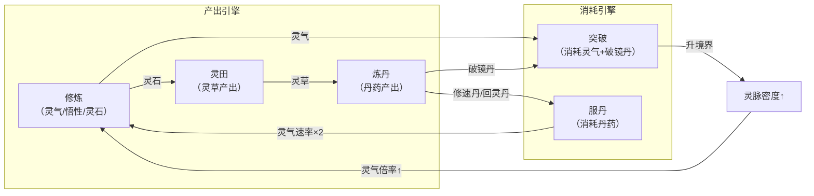

# 7game-lite — 全局产品需求文档 (MASTER-PRD)

> **版本**：v1.1 | **最后更新**：2026-03-28
> **文档角色**：宪法层索引 — 所有 Phase 的产品需求总纲
> **阅读策略**：本文件为索引，永远在 Bootstrap 时读取。按需阅读 detail 文件。

---

## §1 产品定位

### 1.1 一句话定义

> **用最低成本验证「纯文字 MUD + AI 灵智弟子」能否独立构成核心乐趣。**

### 1.2 目标用户

| 维度 | 描述 |
|------|------|
| **核心画像** | 喜欢文字放置类游戏的修仙题材爱好者 |
| **平台** | 浏览器 Web（后期迁移 Electron） |
| **操作深度** | 低操作、高策略 — 弟子自动行动，宗主下达战略指令 |
| **使用场景** | 挂机为主、间歇查看 MUD 日志和弟子行为 |

### 1.3 核心假设

1. 纯文字 MUD + AI 灵智弟子能独立构成核心乐趣
2. 纯 Web（浏览器），后期移植 Electron
3. AI 灵智为首发核心（非后期接入）
4. 骨架集 6 系统：修炼 + 弟子 + MUD + 灵田 + 炼丹 + 天劫
5. 止步筑基圆满（验证范围最小化）
6. 弟子固定 4 人，AI 事件驱动推理

### 1.4 成功指标

| 指标 | 目标 | 验证方式 |
|------|------|---------| 
| 核心循环可运行 | 从炼气1到筑基圆满全流程无阻断 | 自动化验证脚本 |
| AI 弟子有"生命感" | 弟子行为台词非千篇一律 | 人工体验评估 |
| 挂机体验流畅 | CPU ≤ 3%、内存 ≤ 200MB | 性能检测 |
| 系统闭环无通胀 | 灵石/灵气无净产出死循环 | 数值验证脚本 |

---

## §2 核心体验闭环

> 弟子修炼产灵气 → 弟子种田产灵草 → 弟子炼丹产丹药 → 服用丹药加速/突破 → 突破升境界 → 灵脉密度↑ → 全局灵气加速

---

## §3 全局资源经济 → [detail](prd/economy.md)

> 13 种资源的产出/消耗/通胀分析。涉及数值设计时必读。

---

## §4 系统清单与边界

### 4.1 IN/OUT 总表

| ✅ IN（lite 范围内） | 🚫 OUT（lite 范围外） |
|:---|:---|
| 修炼引擎（炼气 1 → 筑基圆满） | 金丹及以上境界 |
| 弟子行为树（4 人 × 7 态） | 弟子招募 / 扩展至 8~12 人 |
| AI 灵智台词 + 目标生成 | 社交事件 / 夺舍 / 危机 |
| MUD 文字面板 + 命令输入 | 图形渲染 / PixiJS / Canvas |
| 灵田种植（无限格，弟子×3块） | 废丹回收 / 丹毒 / 宅邸灵气 |
| 炼丹（3 丹方） | 结丹天劫及以上 |
| 突破系统（概率模型） | 薪俸 / 忠诚度系统 |
| localStorage 存档 | 云存档 / 多设备同步 |
| 纯 Web 运行 | Electron 壳（Phase C 迁移） |

### 4.2 已实现 / 规划中系统 → [detail](prd/systems.md)

> 9 个已实现系统 + 4 个规划中系统的文档索引。

---

## §5 版本演进路线图

| 版本 | Phase | 关键里程碑 | 状态 |
|------|-------|----------|------|
| **v0.1** | A | 核心循环：修炼+弟子+MUD+AI | ✅ 完成 |
| **v0.2** | B-α | 灵田+炼丹+存档迁移 v1→v2 | ✅ 完成 |
| **v0.3** | C | 突破+灵脉+丹药使用+存档 v2→v3 | ✅ 完成 |
| **v0.4** | D | 天劫+悬赏+AI 深化 | 🔜 待启动 |
| **v0.5** | E | 丹毒系统 | 📋 规划中 |
| **v1.0** | — | 验证完毕，核心乐趣确认 | 📋 规划中 |

---

## §6 数值基线索引 → [detail](prd/formulas.md)

> 13 个公式函数 + 3 个数据表文件的完整清单。涉及公式变更时必读。

---

## §7 文档格式说明（过渡方案）

| Phase | 格式 | 文件命名 |
|-------|------|---------|
| A / B-α / C（已有） | 旧 SGPA 十步 | `features/xxx-analysis.md`（保留不动） |
| D+（新增） | 新 Trinity 三文件 | `features/[name]-PRD.md` + `design/specs/[name]-TDD.md` |

---

## Detail 文件清单

| 文件 | 内容 | 维护 Skill |
|------|------|-----------|
| [`prd/economy.md`](prd/economy.md) | 资源总表 + 漏斗图 + 通胀分析 | /SPM |
| [`prd/systems.md`](prd/systems.md) | 已实现 + 规划中系统清单 | /SPM, /SGE |
| [`prd/formulas.md`](prd/formulas.md) | 公式函数 + 数据表索引 | /SPM, /SGE |

---

## 变更日志

| 日期 | 版本 | 变更内容 |
|------|------|---------|
| 2026-03-28 | v1.0 | 初始创建，整合 Phase A/B-α/C 三份 analysis 文档 |
| 2026-03-28 | v1.1 | 模块化拆分：§3→economy.md, §4.2~4.3→systems.md, §6→formulas.md |
