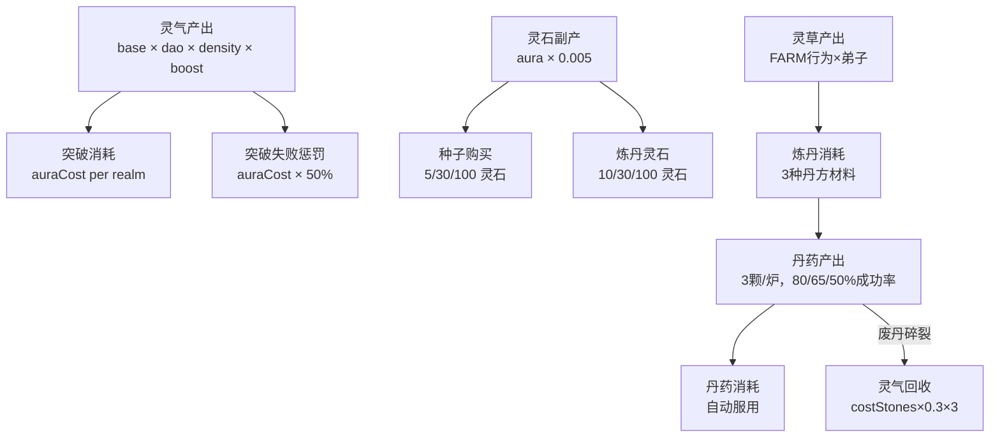

# 全局资源经济

> **来源**：MASTER-PRD 拆分 | **维护者**：/SPM
> **索引入口**：[MASTER-PRD.md](../MASTER-PRD.md) §3

---

## §1 资源总表

| 资源 | 产出来源 | 消耗去向 | 单位 |
|------|---------|---------|------|
| **灵气** | 修炼（基础×道基×灵脉密度×修速丹）。灵脉密度由 `getSpiritVeinDensity()` 按境界动态计算，非 `sect.auraDensity` 字段 | 突破门槛、突破失败惩罚 | 点 |
| **灵石** | 灵气副产（×0.005）、初始 200 | 买种子、炼丹灵石消耗 | 枚 |
| **悟性** | 灵气副产（×0.05） | 炼丹解锁门槛（100/500） | 点 |
| **清心草** | 灵田种植（30s/2份） | 回灵丹×3、修速丹×2 | 份 |
| **碧灵果** | 灵田种植（90s/1份） | 修速丹×1、破镜丹×1 | 份 |
| **破境草** | 灵田种植（180s/1份） | 破镜丹×2 | 份 |
| **回灵丹** | 炼丹（成功率80%） | 突破前自动补灵气 | 颗 |
| **修速丹** | 炼丹（成功率65%） | 灵气速率×2，60s×品质 | 颗 |
| **破镜丹** | 炼丹（成功率50%） | 突破成功率+15%×品质/颗 | 颗 |
| **仙历时间** | 自动推进（0.5/30/10 /s） | 世界观时间流逝 | 年 |
| **弟子时间** | 实时（4弟子×7行为） | FARM/ALCHEMY/MEDITATE等 | tick |
| **弟子灵气** | 行为结束奖励（`getBehaviorAuraReward()`） | 当前无消耗（预留，v0.4+ 定义 Sink） | 点 |
| **宗门声望** | 悬赏完成（Phase D） | 当前无消耗（Phase D 定义解锁条件） | 点 |

---

## §2 产出→消耗漏斗图

---

## §3 通胀/Sink 分析

| 资源 | 产出 Sink | 通胀风险 | 状态 |
|------|----------|---------|------|
| **灵气** | 突破消耗按指数增长（60→150K→500K→2M→...） | ✅ 低 | 突破门槛指数级增长天然抑制通胀 |
| **灵石** | 种子+炼丹持续消耗 | ✅ 低 | 副产率仅 0.5%，消耗场景多 |
| **悟性** | 仅作解锁门槛，无消耗机制 | ⚠️ 中 | 累计值只增不减，但无滥用路径 |
| **灵草** | 炼丹严格消耗 | ✅ 低 | 产出速率受弟子时间限制 |
| **丹药** | 自动服用消耗 | ✅ 低 | 库存受炼丹成功率+废丹碎裂双重限制 |
| **修速丹×灵脉** | — | ⚠️ 需监控 | 筑基3期 density=5.0 × boost=2.0 = 10× — 需验证脚本确认 |

---

## 变更日志

| 日期 | 变更内容 |
|------|---------|
| 2026-03-28 | 从 MASTER-PRD.md §3 拆出，独立文件 |
