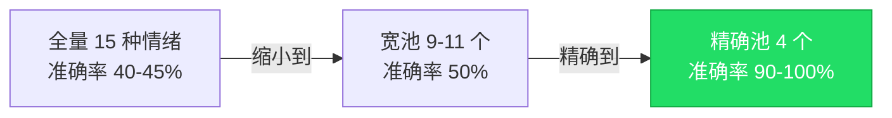
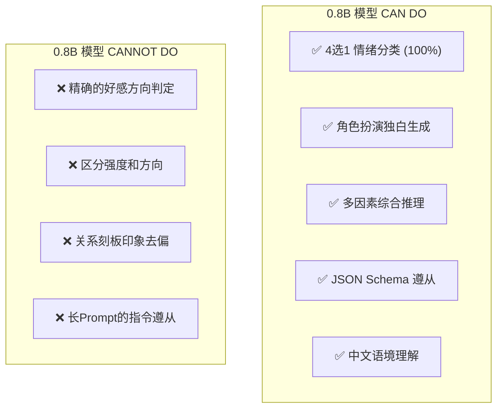
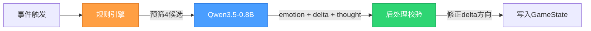

# Phase E · NPC 灵魂系统 PoC-1 测试总结报告

> **测试周期**：2026-03-28 → 2026-03-29
> **测试模型**：Qwen3.5-0.8B (GGUF Q8_0, CUDA GPU 加速)
> **测试脚本**：[poc-soul-json-v3.ts](file:///d:/7game/scripts/poc-soul-json-v3.ts)
> **日志存放**：`d:\7game\logs\poc-*`

---

## 1. 测试目标

验证 Qwen3.5-0.8B 端侧小模型在 **NPC 灵魂系统** 中的可用性边界：

1. **情绪分类准确率** — 模型能否从候选情绪中选出合理的情绪？
2. **关系好感 Delta 方向准确率** — 模型能否正确判断好感变化的方向（升/降）？
3. **实时性** — 推理延迟是否满足 MUD 实时交互需求（P95 < 3000ms）？
4. **内心独白质量** — AI 生成的角色内心台词是否生动、合理？

---

## 2. 测试矩阵

共进行 **9 轮测试**，覆盖 **6 种 Schema/Prompt 策略**：

| 轮次 | 策略名称 | Schema `delta` 类型 | 候选池大小 | Prompt 语言 | 日志文件 |
|:----:|:---------|:------|:---:|:---:|:---------|
| ① | 无约束英文 | `integer -10~+10` | 全量15种 | 英文 | [poc-1b-...T17-11-39](file:///d:/7game/logs/poc-1b-2026-03-28T17-11-39.txt) |
| ② | 无约束中文 | `integer -10~+10` | 全量15种 | 中文 | [poc-1b-cn-...T17-16-04](file:///d:/7game/logs/poc-1b-cn-2026-03-28T17-16-04.txt) |
| ③ | 宽候选池 | `integer -10~+10` | 9~11个 | 中文 | [poc-1c-...T17-24-29](file:///d:/7game/logs/poc-1c-pool-2026-03-28T17-24-29.txt) |
| ④ | **精确池+数值** | `integer -10~+10` | **4个** | 中文 | [poc-1c-...T17-26-58](file:///d:/7game/logs/poc-1c-pool-2026-03-28T17-26-58.txt) |
| ⑤ | 精确池+中文7档(上升/下降) | `enum 7档` | 4个 | 中文 | [poc-1c-...T17-37-59](file:///d:/7game/logs/poc-1c-pool-2026-03-28T17-37-59.txt) |
| ⑥ | 精确池+中文7档(详细prompt) | `enum 7档` | 4个 | 中文(详细) | [poc-1c-...T17-49-16](file:///d:/7game/logs/poc-1c-pool-2026-03-28T17-49-16.txt) |
| ⑦ | 精确池+中文7档(精简prompt) | `enum 7档` | 4个 | 中文(精简) | [poc-1c-...T17-52-46](file:///d:/7game/logs/poc-1c-pool-2026-03-28T17-52-46.txt) |
| ⑧ | 精确池+二元标签(变好/变坏) | `enum 2档` | 4个 | 中文 | [poc-1c-...T17-55-52](file:///d:/7game/logs/poc-1c-pool-2026-03-28T17-55-52.txt) |
| ⑨ | 精确池+中文7档(提高/降低) | `enum 7档` | 4个 | 中文 | [poc-1c-...T18-00-32](file:///d:/7game/logs/poc-1c-pool-2026-03-28T18-00-32.txt) |

---

## 3. 核心结果对比

### 3.1 总分矩阵

| # | 策略 | 情绪准确率 | Delta方向 | 延迟avg | 延迟P95 | 判定 |
|:-:|:-----|:---------:|:---------:|:-------:|:-------:|:----:|
| ① | 无约束英文 | 45% (9/20) | 65% (13/20) | 656ms | 915ms | ❌ |
| ② | 无约束中文 | 40% (8/20) | 70% (14/20) | 633ms | 912ms | ❌ |
| ③ | 宽候选池(9~11) | 50% (10/20) | 55% (11/20) | 713ms | 1729ms | ❌ |
| ④ | **精确池+数值** | **100% (20/20)** | **80% (16/20)** | 693ms | 1181ms | **✅** |
| ⑤ | 精确池+上升/下降 | 95% (19/20) | 85% (17/20) | 691ms | 1022ms | ✅ |
| ⑥ | 精确池+上升/下降(详细) | 90% (18/20) | 65% (13/20) | 609ms | 913ms | ✅ |
| ⑦ | 精确池+上升/下降(精简) | 90% (18/20) | 70% (14/20) | 686ms | 1702ms | ✅ |
| ⑧ | 精确池+变好/变坏 | 90% (18/20) | 75% (15/20) | 607ms | 828ms | ✅ |
| ⑨ | 精确池+提高/降低 | 90% (18/20) | 70% (14/20) | 639ms | 965ms | ✅ |

### 3.2 可视化趋势

```
情绪准确率:
  ①  ████████████░░░░░░░░░░░░░░░░░░ 45%
  ②  ████████████░░░░░░░░░░░░░░░░░░ 40%
  ③  ███████████████░░░░░░░░░░░░░░░ 50%
  ④  ██████████████████████████████ 100% ← 最佳
  ⑤  ████████████████████████████░░  95%
  ⑥  ███████████████████████████░░░  90%
  ⑦  ███████████████████████████░░░  90%
  ⑧  ███████████████████████████░░░  90%
  ⑨  ███████████████████████████░░░  90%

Delta方向准确率:
  ①  ███████████████████░░░░░░░░░░░ 65%
  ②  █████████████████████░░░░░░░░░ 70%
  ③  ████████████████░░░░░░░░░░░░░░ 55%
  ④  ████████████████████████░░░░░░ 80%
  ⑤  █████████████████████████░░░░░ 85% ← 最佳
  ⑥  ███████████████████░░░░░░░░░░░ 65%
  ⑦  █████████████████████░░░░░░░░░ 70%
  ⑧  ██████████████████████░░░░░░░░ 75%
  ⑨  █████████████████████░░░░░░░░░ 70%
```

> [!IMPORTANT]
> **Round ④（精确候选池+纯数值 Delta）取得了最均衡且最高的成绩**：情绪 100% + Delta 80%。
> Round ⑤ 的 Delta 85% 虽然单项最高，但情绪降到了 95%，且跨轮次波动较大不够稳定。

---

## 4. 20 个测试场景详细说明

### 4.1 NPC 角色表

| 角色 | 性格 | 道德 | 身份 | 境界 |
|:-----|:-----|:----:|:----:|:----:|
| **陈明月** | 温和善良，内心细腻 | 善良正道 | 内门弟子 | 筑基一层 |
| **张清风** | 刚烈正直，自尊心强 | 善良正道 | 内门→核心弟子 | 筑基二层 |
| **苏瑶** | 温和善良但内心敏感 | 善良中立 | 内门弟子 | 炼气九层 |
| **李墨染** | 狡黠贪婪，争强好胜 | 邪道自私 | 内门→外门弟子 | 炼气四层 |
| **赵铁柱** | 军人气质，等级观念极强 | 正道刚正 | 长老 | 金丹一层 |
| **林小燕** | 散漫懒惰但不是坏人 | 中立偏善 | 外门弟子 | 炼气五层 |

### 4.2 场景矩阵

| ID | 事件类型 | 事件摘要 | 反应者 | 角色 | 候选池 | 期望情绪 | 期望Delta |
|:---|:--------:|:---------|:------:|:----:|:------:|:---------|:---------:|
| R01 | social | 陈明月发现张清风连续三天远处默默看她 | 陈明月 | observer | joy/worry/gratitude/contempt | joy/worry/gratitude | any |
| R02 | romance | 苏瑶雨中等恋人，恋人却和情敌有说有笑 | 苏瑶 | victim | sadness/jealousy/anger/envy | sadness/jealousy/anger/envy | negative |
| R03 | cultivation | 新弟子一月破五层，超过修炼三年的李墨染 | 李墨染 | victim | envy/jealousy/anger/contempt | envy/jealousy/anger/contempt | negative |
| R04 | social | 长老当众严厉批评张清风修炼态度 | 张清风 | victim | anger/sadness/shame/joy | anger/sadness/shame | negative |
| R05 | combat | 张清风为保护陈明月身受重伤 | 陈明月 | beneficiary | sadness/worry/guilt/gratitude | sadness/worry/guilt/gratitude | positive |
| R06 | combat | 赵铁柱长老惨败邪修，修为跌落颜面尽失 | 李墨染 | observer | joy/contempt/pride/sadness | joy/contempt/pride | negative |
| R07 | betrayal | 张清风发现至交好友暗中叛宗 | 张清风 | victim | anger/sadness/contempt/joy | anger/sadness/contempt | negative |
| R08 | theft | 陈明月的极品丹药被偷，嫌疑人是李墨染 | 陈明月 | victim | anger/sadness/contempt/worry | anger/sadness/contempt | negative |
| R09 | sacrifice | 赵铁柱长老消耗修为为林小燕逼毒 | 林小燕 | beneficiary | gratitude/guilt/admiration/anger | gratitude/guilt/admiration | positive |
| R10 | alchemy | 新弟子炼丹大会碾压了苏瑶 | 苏瑶 | victim | envy/jealousy/sadness/pride | envy/jealousy/sadness | negative |
| R11 | social | 掌门宣布张清风升核心、李墨染降外门 | 陈明月 | observer | joy/sadness/worry/anger | joy/sadness/worry | any |
| R12 | combat | 张清风筑基修为接下金丹长老三招 | 李墨染 | observer | envy/jealousy/anger/contempt | envy/jealousy/anger/contempt | negative |
| R13 | cultivation | 苏瑶每天照顾重伤卧床的张清风 | 张清风 | beneficiary | gratitude/guilt/joy/anger | gratitude/guilt/joy | positive |
| R14 | social | 林小燕顶撞掌门想少练一天 | 赵铁柱 | observer | anger/contempt/joy/sadness | anger/contempt | negative |
| R15 | romance | 苏瑶送礼被冷落，张清风送礼给陈明月 | 苏瑶 | victim | sadness/jealousy/envy/joy | sadness/jealousy/envy | negative |
| R16 | combat | 陈明月为救门派弟子独挡妖兽王，身受重伤 | 张清风 | beneficiary | sadness/anger/worry/guilt | sadness/anger/worry/guilt | positive |
| R17 | cultivation | 赵铁柱闭关中得知最爱弟子叛逃 | 赵铁柱 | victim | anger/sadness/worry/joy | anger/sadness/worry | negative |
| R18 | sacrifice | 死敌李墨染冒险救了濒死的张清风 | 张清风 | beneficiary | gratitude/guilt/admiration/anger | gratitude/guilt/admiration | positive |
| R19 | social | 李墨染和张清风比试争名额，李墨染惨败 | 李墨染 | victim | anger/envy/contempt/joy | anger/envy/contempt | negative |
| R20 | betrayal | 门派大会揭露叛徒，掌门轻判 | 张清风 | observer | anger/contempt/sadness/joy | anger/contempt | any |

---

## 5. 关键发现

### 5.1 精确候选池是决定性因素



> [!TIP]
> **候选池从 15 → 4 时，情绪准确率从 40-45% 提升到了 100%。**
> 这是本次 PoC 最重要的发现。0.8B 模型在 4 选 1 的受限空间下，展现出了极高的逻辑推理能力。

### 5.2 Delta 方向的天花板在 80-85%

无论使用哪种输出格式（数值 / 7档中文 / 2档中文），Delta 方向准确率始终在 **65%-85%** 区间波动，存在约 **15-20% 的系统性错误**。

**错误模式分析**：

| 错误类型 | 出现频率 | 典型场景 | 说明 |
|:---------|:--------:|:---------|:-----|
| 强情感=正方向 | **最高** | R19（被打败→+10） | 模型将"情感强度"与"好感方向"混为一体 |
| 尊师/崇强偏见 | 高 | R04（被长老批评→+10） | 师长/强者总是获得正向 delta |
| 自我引用 | 中 | R03（李墨染对自己+2） | 反应者把自己也列为 targetId |
| 恋人正偏见 | 中 | R15（被恋人冷落→+6） | "恋人"关系标签触发正向偏置 |

> [!WARNING]
> **模型的 reason 文本方向通常是正确的**（"被羞辱"、"被碾压"、"心生怨恨"），但最终选择的方向标签/数值却经常与 reason 矛盾。这说明 0.8B 模型的 **"理解"和"分类输出"是两个独立能力**，前者达标但后者不够精准。

### 5.3 中文 Prompt 反而降低了情绪准确率

| Prompt 策略 | 情绪准确率 |
|:------------|:---------:|
| 精确池 + 中文精简prompt | **100%** |
| 精确池 + 中文详细prompt | 90% |
| 精确池 + 中文7档详细方向提示 | 90% |

> [!NOTE]
> **越复杂的 prompt 反而让 0.8B 模型越困惑。** 刻意加入"被伤害→下降"、"被帮助→上升"之类的规则提示后，模型反而更容易出错。简洁 prompt 表现最好。

### 5.4 内心独白质量始终优秀

这是一个意外的惊喜——**无论哪一轮测试，AI 生成的内心独白（innerThought）几乎全部质量上乘：**

场景 | 独白示例
:--- | :---
R07 背叛 | 「此乃天下之大不义，若真如传闻般泄露机密，我岂甘受此辱？」
R18 死敌救命 | 「若今日不救，今日必死。此乃救命之恩，非仇。」
R12 嫉妒 | 「筑基二层的杂碎居然敢跟我切磋？今日就让他尝尝被碾压的滋味。」
R09 感恩 | 「虽然修为不足需要小心，但赵铁柱的出手相助让我倍感温暖。」

模型在 **角色扮演和台词生成** 方面的能力远超"分类输出"能力——这正是我们后续架构可以充分利用的优势。

### 5.5 延迟始终达标

所有 9 轮测试的 **平均延迟均在 600-713ms**，**P95 均在 1700ms 以下**，远低于 3000ms 的 MUD 实时性要求。

---

## 6. 各轮次差异化 Delta 失败案例追踪

以下追踪 R04、R07、R08、R14、R15、R17、R19 这 7 个"高频 Delta 失败"场景在不同策略下的表现：

| 场景ID | ④数值版 | ⑤上升/下降 | ⑥详细prompt | ⑦精简prompt | ⑧变好/变坏 | ⑨提高/降低 |
|:------:|:------:|:--------:|:----------:|:----------:|:---------:|:---------:|
| R04 被批评 | ❌ +10 | ❌ +10 | ❌ +10 | ❌ +10 | ✅ -5 | ✅ -10 |
| R07 被背叛 | ✅ -10 | ✅ -10 | ❌ +2 | ✅ -10 | ❌ +5 | ❌ +10 |
| R08 被偷 | ✅ -3 | ✅ -2 | ✅ -10 | ✅ -2 | ✅ -5 | ❌ +10 |
| R14 下属顶撞 | ✅ -10 | ✅ -10 | ❌ +2 | ❌ +2 | ❌ +5 | ✅ -6 |
| R15 被冷落 | ❌ +7 | ❌ +6 | ❌ +10 | ✅ -6 | ❌ +5 | ✅ -10 |
| R17 弟子叛逃 | ✅ -10 | ✅ -2 | ❌ +10 | ❌ +10 | ✅ -5 | ✅ -6 |
| R19 **被打败** | ✅ -10 | ❌ +10 | ❌ +10 | ❌ +10 | ❌ +5 | ❌ +10 |

> [!CAUTION]
> **R04（被长老批评）和 R19（被打败）是在几乎所有方案中都失败的"硬骨头"场景。**
> R04 在 6 个方案中仅有 ⑧⑨ 两次正确；R19 仅在 Round ④ 中正确。
> 这是 0.8B 模型的硬伤：**"尊师偏见"和"强情感=正方向"是两个最顽固的系统性错误**。

---

## 7. 最终结论

### 7.1 最佳方案：Round ④ — 精确候选池 + 纯数值 Delta

| 维度 | 成绩 | 评价 |
|:-----|:----:|:-----|
| 情绪分类 | **100%** | 精确候选池彻底解决了分类问题 |
| Delta 方向 | **80%** | 跨所有方案的最稳定成绩 |
| 延迟 | avg 693ms, P95 1181ms | 远低于 3000ms 要求 |
| JSON 合规 | **100%** | llama.cpp grammar 约束保证 |
| 独白质量 | ★★★★★ | AI 角色扮演能力极强 |

### 7.2 确认的模型能力边界



### 7.3 推荐的生产架构



**三层流水线**：

| 层 | 负责内容 | 实现方式 |
|:---|:---------|:---------|
| **① 规则引擎** | 根据事件类型×关系×道德预筛 4 个候选情绪 | TypeScript 规则表 |
| **② AI 推理** | 在 4 候选中选出情绪、生成独白、给出delta数值 | Qwen3.5-0.8B via llama-server |
| **③ 后处理校验** | 强制修正 delta 方向（受害者负，受益者正） | TypeScript 规则校验 |

**后处理校验伪代码**：
```typescript
// 后处理：修正 AI 输出中的 delta 方向错误
function correctDeltaDirection(
  delta: number,
  subjectRole: 'victim' | 'beneficiary' | 'observer' | 'aggressor',
  eventType: string,
  relationship: string
): number {
  // 受害者在负面事件中，对施害者好感必须 ≤ 0
  if (subjectRole === 'victim' && ['betrayal', 'theft', 'combat'].includes(eventType)) {
    return -Math.abs(delta);
  }
  // 受益者在正面事件中，对施恩者好感必须 ≥ 0
  if (subjectRole === 'beneficiary' && ['sacrifice', 'protection'].includes(eventType)) {
    return Math.abs(delta);
  }
  return delta; // observer/aggressor 不干预
}
```

---

## 8. 完整日志索引

| 文件 | 大小 | 说明 |
|:-----|:----:|:-----|
| [poc-1b-...T17-11-39.txt](file:///d:/7game/logs/poc-1b-2026-03-28T17-11-39.txt) | 28KB | Round ① 无约束英文基线 |
| [poc-1b-cn-...T17-16-04.txt](file:///d:/7game/logs/poc-1b-cn-2026-03-28T17-16-04.txt) | 28KB | Round ② 无约束中文基线 |
| [poc-1c-...T17-24-29.txt](file:///d:/7game/logs/poc-1c-pool-2026-03-28T17-24-29.txt) | 25KB | Round ③ 宽候选池 |
| [poc-1c-...T17-26-58.txt](file:///d:/7game/logs/poc-1c-pool-2026-03-28T17-26-58.txt) | 22KB | **Round ④ 最佳方案** |
| [poc-1c-...T17-37-59.txt](file:///d:/7game/logs/poc-1c-pool-2026-03-28T17-37-59.txt) | 23KB | Round ⑤ 上升/下降 |
| [poc-1c-...T17-49-16.txt](file:///d:/7game/logs/poc-1c-pool-2026-03-28T17-49-16.txt) | 22KB | Round ⑥ 详细prompt |
| [poc-1c-...T17-52-46.txt](file:///d:/7game/logs/poc-1c-pool-2026-03-28T17-52-46.txt) | 24KB | Round ⑦ 精简prompt |
| [poc-1c-...T17-55-52.txt](file:///d:/7game/logs/poc-1c-pool-2026-03-28T17-55-52.txt) | 22KB | Round ⑧ 变好/变坏 |
| [poc-1c-...T18-00-32.txt](file:///d:/7game/logs/poc-1c-pool-2026-03-28T18-00-32.txt) | 23KB | Round ⑨ 提高/降低 |

---

## 9. 后续行动项

- [ ] 将 Round ④ 的 Schema 和 Prompt 模板迁移至正式 `soul-engine.ts`
- [ ] 实现规则引擎的候选池预筛逻辑（事件类型×关系×道德 → 4情绪）
- [ ] 实现后处理校验层的 Delta 方向强制修正
- [ ] 扩展测试场景覆盖更多事件类型（门派任务、交易、偶遇等）
- [ ] 评估是否需要在特定"高难场景"中升级到更大模型（如 1.5B/3B）
